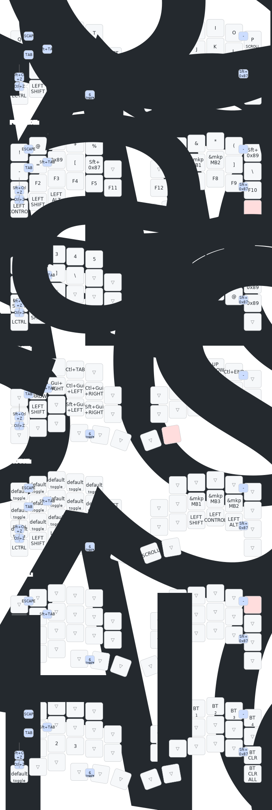

# zmk-config-roBa
日本語配列のOS上で操作する前提でroBaのキー配列を変更したリポジトリです。

- ロータリーエンコーダ無しで使用（スクロールはP押しながらトラックボールを回転で代用）
- AutoMouseはFunctionレイヤーを使用(マウスレイヤーは定義していますが未使用で、JKLが中央、左、右クリックです)

という点に注意してください

## キーマップ解説

各レイヤーの詳細・設計方針・コンボ一覧は [config/change-keymap-desc.md](config/change-keymap-desc.md) を参照してください。

## SVG 上の難解なキーコードについて

このキーマップは OS を **日本語キーボード** 設定のまま使用することを前提としており、一部のキーは生の HID コードで定義されています。SVG 上でそのまま表示されるため、以下の読み替えが必要です。

| SVG 上の表示 | 実際の入力文字 | 説明 |
|-------------|--------------|------|
| `0x89` | `¥` | JIS キーボードの ¥ キー |
| `Shift+0x89` | `\|` | JIS キーボードの \| キー |
| `Shift+0x87` | `_` | JIS キーボードの _ キー（ろキーのシフト） |

その他の記号（`"` `'` `(` `)` `[` `]` `@` `:` `^` `&` `{` `}` `半/全` など）は `keymap_drawer.config.yaml` で補正済みのため、SVG 上では正しい文字で表示されます。